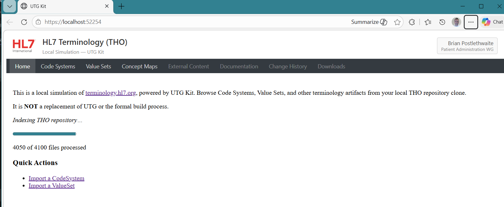
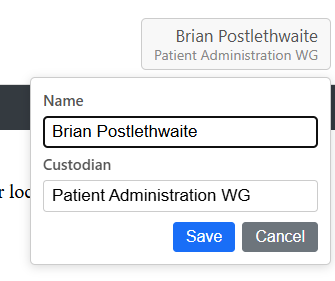
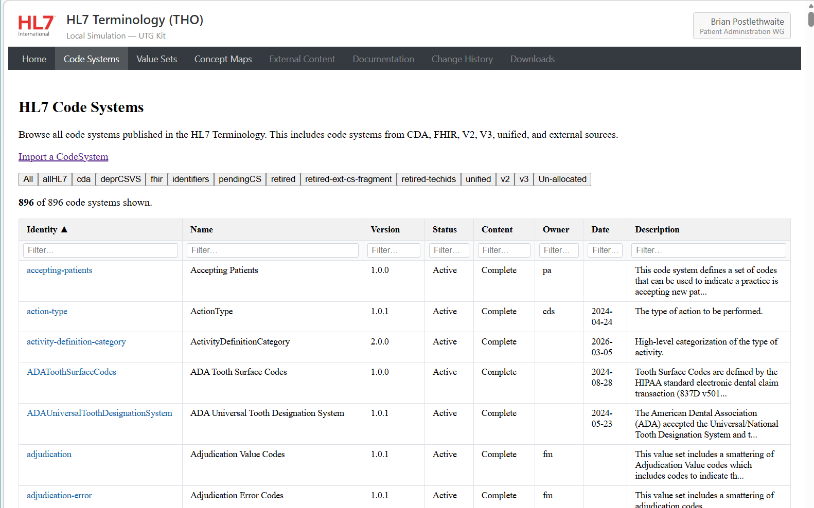
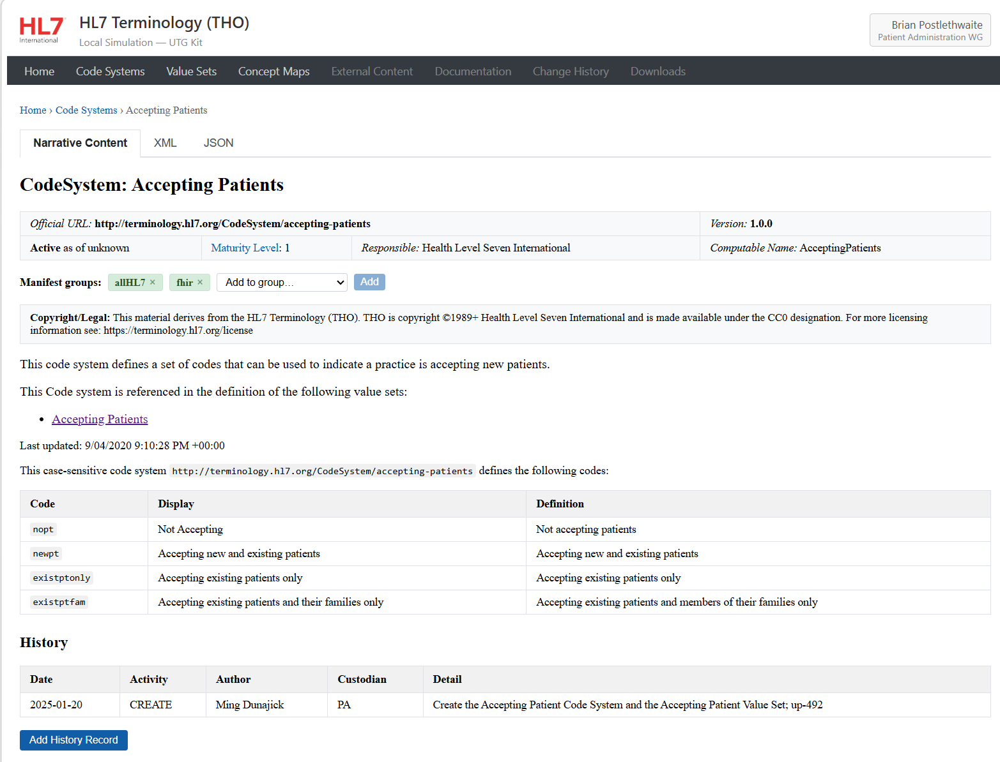
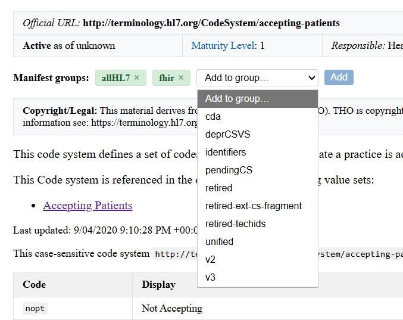
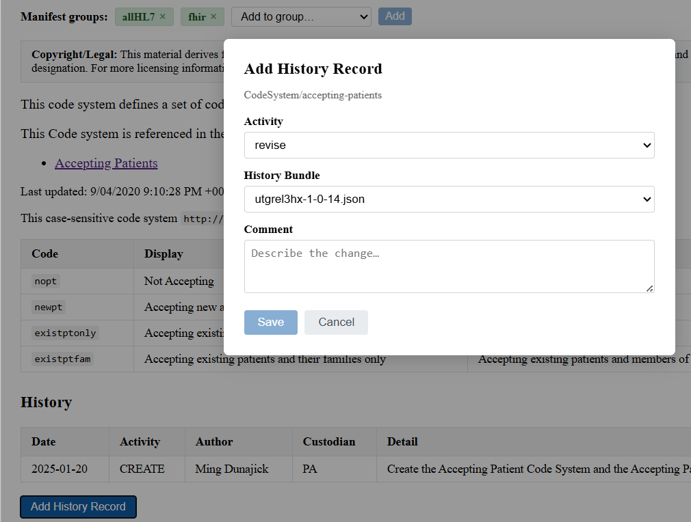
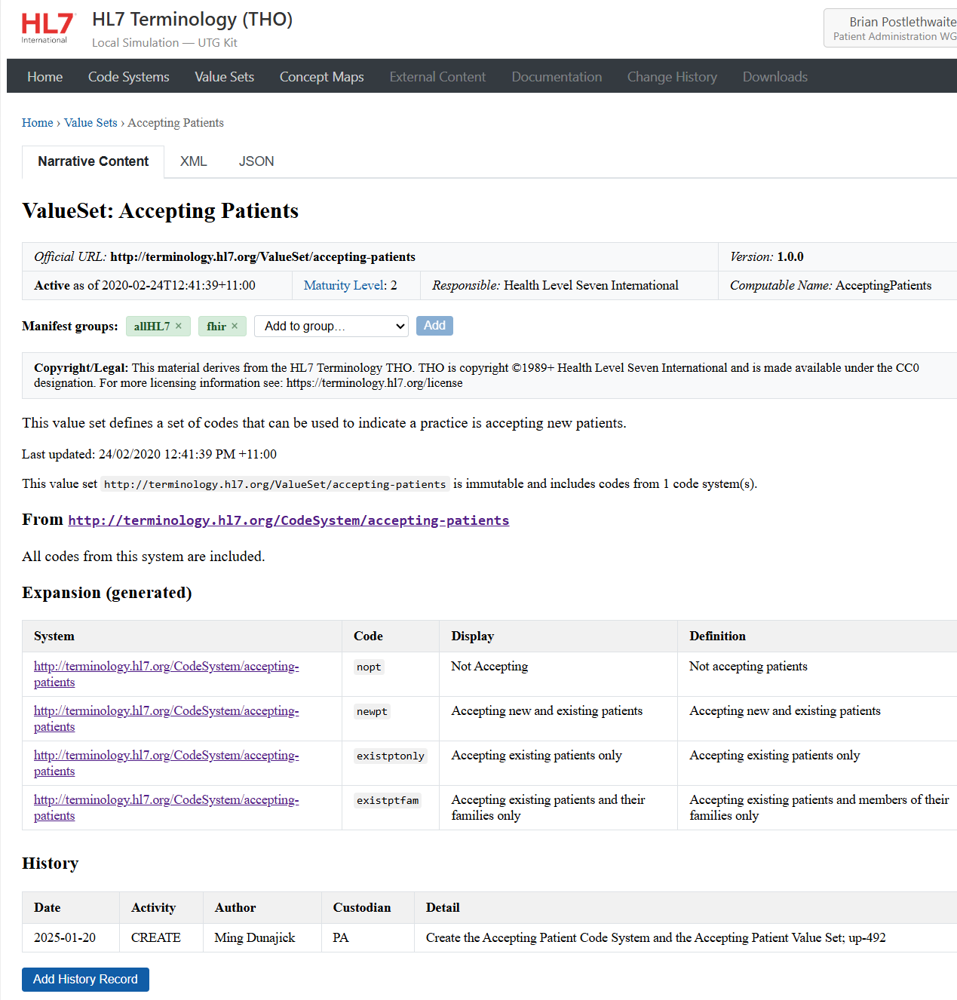

# Overview
The UTG-KIT tooling is there to augment the use of vs-code or other text editing tools to speed up working with the THO source code. Changes made externally via other editors are automatically detected and the display dynamically updates without restarting.

## Server startup
When the server starts up it will immediately index the THO repo. This is a synchronous operation that must complete before the server can handle any requests. The indexing process reads all FHIR resources from the repo and builds in-memory data structures for fast access. This allows the web app to serve pages and MCP requests with low latency, since all data is already loaded in memory.

It has a file system monitor that tracks changes to the files and updates the in-memory index accordingly. This ensures that any edits made through the web app or externally are reflected in real-time without needing to restart the server.
While it is starting the UI will show a loading screen with progress updates. Once indexing is complete, the main UI will be displayed and the user can begin interacting with their terminology artifacts.

## User Profile
The header displays a user profile name in the top-right corner. This name is stored in the browser's `localStorage` under the key `utgkit-user-name` and requires no server-side interaction or authentication.

- **Setting your name:** Click the name badge (or "Set Name" placeholder) in the header, type your name, and press **Save** or **Enter**.
- **Changing your name:** Click the displayed name to re-open the editor.
- **Clearing your name:** Clear the input field and save to reset back to the placeholder.

## CodeSystems

## ValueSets
Teh Valueset list display is roughly the same as the code systems list, and the details has similar features to the Code System Details page, permitting control of manifest groups, hyperlinks to the relevant code systems (where local to UTG) and also the history addition support.

